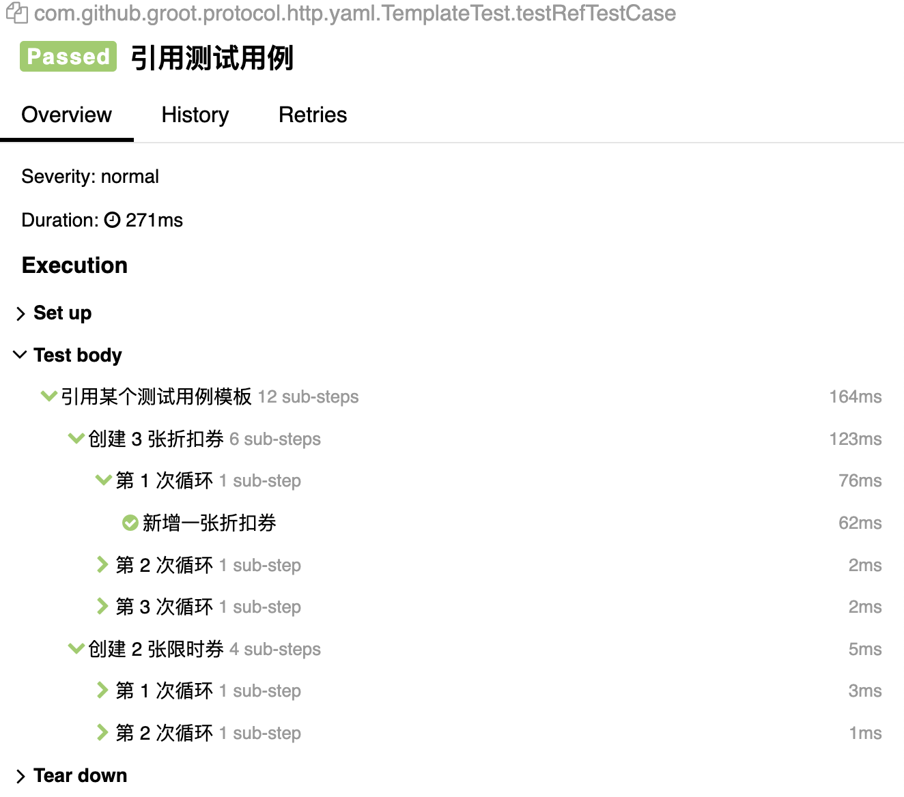

> 当前版本完整实现了核心功能，但支持的提取器、断言、函数和协议数量有限。欢迎提交 Pull 请求或 Issues。 

Groot 的设计目标是提供一个通用、易用、易扩展的自动化测试工具，将自动化测试过程中常见的需求抽象为组件接口，并基于加载的实现类形成特定的测试能力。

工具特性：

- 多环境管理。
- 两种风格用例：
  - 代码风格用例：适用于熟悉编程的测试人员，或复杂用例编写。
  - 配置风格用例：适用于不熟悉编程或要进行平台开发的测开人员。
- 特有的上下文继承机制，方便变量管理和配置继承。
- 切面编程：比如加解密、授权认证、Allure 扩展等。
- 多个扩展点：
  - 支持扩展新的协议或控制器。
  - 支持扩展前后置处理器、提取器、断言。
  - 支持扩展新的函数。
  - 支持扩展新的模板引擎（默认为 FreeMarker 引擎）。
  - 支持扩展新的数据加载器（默认从文件加载）。
- 第三方集成，Groot 未和具体的框架耦合，用户可自由选择 TestNG、Spock 或 Junit 框架编排用例，集成 Allure 或其他测试报告。

## 安装

Maven 安装：

```xml
<dependency>
    <groupId>com.liyunx.groot</groupId>
    <artifactId>groot-all</artifactId>
    <version>0.0.1</version>
</dependency>
```

## 快速入门

**配置风格用例**

当前支持 Yaml/JSON 风格的配置用例。下面是一个 Yaml 用例示例：

```yaml
name: MultiPart 测试用例
steps:
  - name: 上传多个文件
    http:
      url: /multipart/upload
      method: POST
      multipart:
        - file: data/降龙十八掌.txt
        - file: data/独孤九剑.txt
    validate:
      - statusCode: 200
```

等价于

```yaml
name: MultiPart 测试用例
steps:
  - name: 上传多个文件
    http:
      url: /multipart/upload
      method: POST
      multipart:
        - name: file
          headers:
            - name: Content-Disposition
              value: form-data; name="file"; filename="降龙十八掌.txt"
            - name: Content-Type
              value: text/plain
          file: data/降龙十八掌.txt
        - name: file
          headers:
            - name: Content-Disposition
              value: form-data; name="file"; filename="独孤九剑.txt"
            - name: Content-Type
              value: text/plain
          file: data/独孤九剑.txt
    teardown:
      - validate$http$statusCode: 200
```

- 直接编写推荐使用 YAML 用例（并使用简写语法）
- 平台开发推荐使用 JSON 用例（并使用标准语法）

**Java 风格用例**

> 测试框架为 TestNG，依赖 groot-testng

```java
public class PostTest extends GrootTestNGTestCase {

    @BeforeMethod
    public void setUp() {
        // 一般情况下，在 global.yml 或 env-test.yml 配置即可
        // 因为本项目为演示项目，所以这里手动配置，覆盖环境和全局配置，防止多个用例冲突
        sessionConfig(config -> config
            .http(http -> http
                .anyService(any -> any
                    .baseUrl("https://httpbin.org"))));
    }

    @GrootSupport
    @Test
    public void testPost() {
        http("上传文件并保存响应到指定文件（直接请求）", request -> request
            .post("/anything/:id")
            .pathVariable("id", "china")
            .header("myHeader", "myValue")
            .multiPartFile("data/中文.pdf")
            .download("download/上传文件.txt"));

        httpWith("上传文件并保存响应到指定文件（请求并执行配置或前置或后置动作）", action -> action
            .request(request -> request
                .post("/anything/:id")
                .pathVariable("id", "china")
                .header("myHeader", "myValue")
                .multiPartFile("data/中文.pdf")
                .download("download/上传文件.txt"))
            .teardown(teardown -> teardown
                // 提取前先断言，如果请求失败直接结束用例
                .validate(validate -> validate
                    .statusCode(200))
                .extract(extract -> extract
                    .jsonpath("realRequestUrl", "$.url"))
                // 提取后继续断言
                .validate(validate -> validate
                    .equalTo("${realRequestUrl}", "https://httpbin.org/anything/china")
                    .body(containsString("https://httpbin.org/anything/china")))));
    }

}
```

另一个简单的示例：

```java
@Test(description = "validate.body 断言")
public void testValidate_Body() {
    // 直接使用 validate 或 extract，teardown 一般用于复杂的后置处理场景
    httpWith("body 断言", action -> action
        .request(it -> it
            .get(url))
        .validate(it -> it
            .statusCode(200)
            .body(responseBody)
            .body(matchesRegex("[\\s\\S]*\"id\": \"\\S{4}\\d{3}\"[\\s\\S]*"))
            .body(s -> JsonPath.parse(s).read("$.data.id"), equalTo("root888"))));

    // 相比引入变量接收返回值，使用 then 接收一个请求结果处理函数，代码可读性更好
    http("body 断言", it -> it
        .get(url)
    ).then(r -> {
        HttpRealResponse response = r.getResponse();
        assertThat(response.getStatus()).isEqualTo(200);
        assertThat(response.getBody()).isEqualTo(responseBody);
    });
}
```

**Groovy 风格用例**

> 测试框架为 TestNG，依赖 groot-testng

编码形式的用例推荐使用 Groovy 风格用例，易于书写和阅读。

```groovy
def detailValue = "http-get-test"

@Test
void testHttp() {
    
    httpWith("Get 请求") {
        request { 
            get url 
        } extract {
            jsonpath 'detail', '$.data.detail'
        } validate {
            // 方法名冲突时，通过 对象.方法 来区分委托对象的方法和静态导入方法
            def should = delegate
          
            statusCode 200
            should.equalTo '${detail}', "http-get-test"
            // 访问类成员变量或方法使用 this.xxx
            should.equalTo '${detail}', this.detailValue
        }
    }
    
    http('http test') {
        post '/post/:groot'
        pathVariable 'groot', 'GROOT'
        body 'G R O O T'
    }.then {
        assertThat(it.response.body).isEqualTo("T O O R G")
    }
}
```

- 更多用例写法请参考单元测试代码或 groot-examples 项目。
- 当前支持的前后置处理器较少，用户可根据需要自由添加新的实现扩展，或提交 Pull 请求。

## 三方集成

### TestNG

groot-testng 集成了 Groot 与 TestNG，只需在项目中添加该依赖即可。

```xml
<dependency>
    <groupId>com.liyunx.groot</groupId>
    <artifactId>groot-testng</artifactId>
    <version>0.0.1</version>
</dependency>
```

使用时测试用例类继承 GrootTestNGTestCase 或 AbstractGrootTestNGTestCase。

```java
public class GrootSupportTest extends GrootTestNGTestCase {

    @GrootSupport
    @Test
    public void testGrootSupport() {
        Ref<Integer> cnt = Ref.ref(0);
        repeat("3 times", 3, () -> cnt.value++);
        assertThat(cnt.value).isEqualTo(3);
    }

}
```

### Allure

新增配置文件 src/test/resources/groot-test.yml 或 src/main/resources/groot.yml，添加如下配置启用 Allure 报告：

```yaml
allure: true
```

或者命令行运行时使用 `-Dgroot.allure=true` 参数。



## 最佳实践

### 日志分离

当一次执行多条测试用例时，所有日志都在一个文件中不方便进行查看和问题排查。为此，我们需要将每条测试用例的日志隔离开，即一次执行多条测试用例，但可以单独查看某个测试用例的所有日志。

**分离测试用例日志的步骤：**

- *Trace ID 生成和清理：* 
  - 在测试用例开始前生成并设置 Trace ID，在测试用例结束后清理 Trace ID。groot-testng 依赖中内置了 TestCaseLogListener，可以自动完成 Trace ID 生成和清理。
- *日志分离：* 
  - 以 logback 为例，我们可以扩展自定义 Appender 或者使用 SiftingAppender。
- *异步日志跟踪：* 
  - Groot 内置了 TraceableTask 包装线程任务，从而跟踪异步任务的日志。

**配置 logback**

新增一个测试用例日志 Appender，使用 SiftingAppender 根据 TraceID（testcaseId） 筛选每个用例的日志到各自的日志文件。

```xml
<appender name="SIFT" class="ch.qos.logback.classic.sift.SiftingAppender">
    <discriminator>
        <!-- 第一步中设置的 TraceID -->
        <key>testcaseId</key>
        <defaultValue>unknown</defaultValue>
    </discriminator>

    <sift>
        <appender name="FILE-${testcaseId}" class="ch.qos.logback.core.FileAppender">
            <file>${log.home}/case/${testcaseId}.log</file>
            <append>false</append>
            <encoder>
                <pattern>${pattern}</pattern>
            </encoder>
        </appender>
    </sift>
</appender>
```

**异步日志跟踪**

groot-core 内置了 TraceableTask 包装线程任务，从而跟踪异步任务的日志。

使用示例（Groovy + TestNG）：

```java
@Test
public void testAsyncTask(Method method) throws InterruptedException, ExecutionException {
    logger.info("testAsync Start");
    ExecutorService executorService = Executors.newFixedThreadPool(2);
    executorService.execute(TraceableTask.wrap(() -> {
        logger.info("async task 1 execute");
    }));
    Future<String> future = executorService.submit(TraceableTask.wrap(() -> {
        logger.info("async task 2 execute");
        return "successful";
    }));
    logger.info("async task 2 result: {}", future.get());
    executorService.shutdown();
    executorService.awaitTermination(10, TimeUnit.MINUTES);
}
```

查看 `logs/case/TestCaseLogListenerTest.testAsyncTask.0.log` 内容，异步任务的日志已经被追加到用例日志文件中。

```
21:06:46.823 [main] INFO  c.l.g.testng.listener.TestCaseLogListenerTest:29   - testAsync Start 
21:06:46.825 [pool-2-thread-1] INFO  c.l.g.testng.listener.TestCaseLogListenerTest:32   - async task 1 execute 
21:06:46.825 [pool-2-thread-2] INFO  c.l.g.testng.listener.TestCaseLogListenerTest:35   - async task 2 execute 
21:06:46.826 [main] INFO  c.l.g.testng.listener.TestCaseLogListenerTest:38   - async task 2 result: successful 
```

### 变量作用域管理

随意使用 Groot 提供的变量机制，会导致用例难以维护，不方便排查问题。

- 推荐最小作用域原则，能在更小范围内使用的变量，不将变量作用域提升到更大的范围。
  - 推荐使用局部变量，比如一个 HTTP 请求步骤内部使用的变量，先在当前步骤的配置中进行变量声明，或显式设置提取作用域为 LOCAL。
- 如果代码测试用例采用分层设计，即普遍的 API、Service、TestCase 三层：
  - 尽量在方法内部管理这些 Groot 变量，避免变量外溢
  - 尽量避免使用 Groot 提供的变量机制在不同层级间传递数据（全局变量和环境变量除外）
  - 不同层级间的数据传递，尽量使用方法参数等 IDE 友好的方案